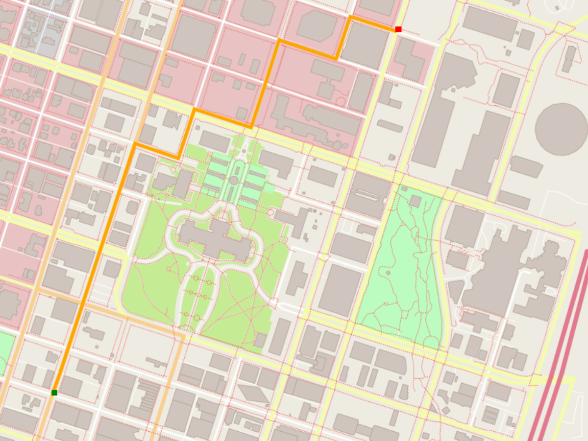

# Route Planning Engine: A* vs Dijkstra on OpenStreetMap

A C++ pathfinding engine that finds optimal routes on real-world OpenStreetMap data using A* and Dijkstra algorithms with live map rendering.



---

## Overview

This project implements and compares two shortest-path algorithms on OpenStreetMap road networks:

* A* Search
* Dijkstra's Algorithm

Both algorithms produce the same optimal route. A* reaches the destination faster by using a heuristic to guide the search toward the target.

---

## Benchmark Results

Tests were run on the default `map.osm` file using coordinates `10 10 90 90`.

| Algorithm | Distance     | Time Taken         | Nodes Explored    |
| --------- | ------------ | ------------------ | ----------------- |
| A* Search | 873.4 meters | ~1200 microseconds | Fewer (guided)    |
| Dijkstra  | 873.4 meters | ~3800 microseconds | More (exhaustive) |

### Why A* Is Faster

* Dijkstra explores nodes uniformly in all directions until the destination is found.
* A* uses the Euclidean distance to the goal as a heuristic, prioritizing nodes that are closer to the destination.
* Both algorithms guarantee the optimal shortest path.
* While both have a theoretical complexity of **O(E log V)**, A* usually explores far fewer nodes in practice.

---

## Tech Stack

* C++17
* OpenStreetMap (OSM)
* IO2D Graphics Library
* CMake
* Google Test
* Linux / WSL

---

## Project Structure

```text
route-planning/
├── src/
│   ├── main.cpp
│   ├── route_planner.cpp
│   ├── route_planner.h
│   ├── route_model.cpp
│   ├── route_model.h
│   ├── model.cpp
│   └── render.cpp
├── test/
├── thirdparty/
├── map.osm
└── CMakeLists.txt
```

---

## Building and Running

### Prerequisites

Install dependencies:

```bash
sudo apt update
sudo apt install -y build-essential cmake libcairo2-dev libgraphicsmagick1-dev libpng-dev
```

### Install IO2D

```bash
git clone --recurse-submodules https://github.com/cpp-io2d/P0267_RefImpl
cd P0267_RefImpl
mkdir Debug && cd Debug
cmake --config Debug "-DCMAKE_BUILD_TYPE=Debug" ..
cmake --build .
sudo make install
```

### Clone the Repository

```bash
git clone https://github.com/<your-username>/route-planning.git --recurse-submodules
cd route-planning
```

### Build

```bash
mkdir build && cd build
cmake .. -DCMAKE_PREFIX_PATH=$HOME/io2d -DCMAKE_POLICY_VERSION_MINIMUM=3.5
make OSM_A_star_search
```

### Run

```bash
./OSM_A_star_search
```

Enter coordinates when prompted:

```text
Set start and ending points: start_x start_y end_x end_y
10 10 90 90
```

### Run with a Custom Map

Download a map from OpenStreetMap and run:

```bash
./OSM_A_star_search -f ../your_city.osm
```

---

## Using Custom Maps

1. Open OpenStreetMap.
2. Search for a city or region.
3. Zoom into the desired area.
4. Click **Export**.
5. Save the file as `.osm`.
6. Place the file in the project root.
7. Run the application with:

```bash
./OSM_A_star_search -f ../your_file.osm
```

For best performance, keep the exported area relatively small.

---

## Algorithm Details

### A* Search

```text
f(n) = g(n) + h(n)
```

* `g(n)` is the distance from the start node.
* `h(n)` is the estimated distance to the goal.
* Expands nodes with the lowest total cost first.
* Finds the optimal path efficiently by guiding the search toward the destination.

### Dijkstra's Algorithm

```text
f(n) = g(n)
```

* Uses only the distance traveled from the start.
* Explores nodes uniformly.
* Guarantees the shortest path.
* Typically explores more nodes than A*.

---

## Sample Output

```text
========== A* SEARCH ==========
Distance : 873.4 meters
Time     : 1243 microseconds
==============================

========== DIJKSTRA SEARCH ==========
Distance : 873.4 meters
Time     : 3891 microseconds
=====================================
```

Both algorithms produce the same shortest path. A* completes the search faster because the heuristic reduces unnecessary exploration.
